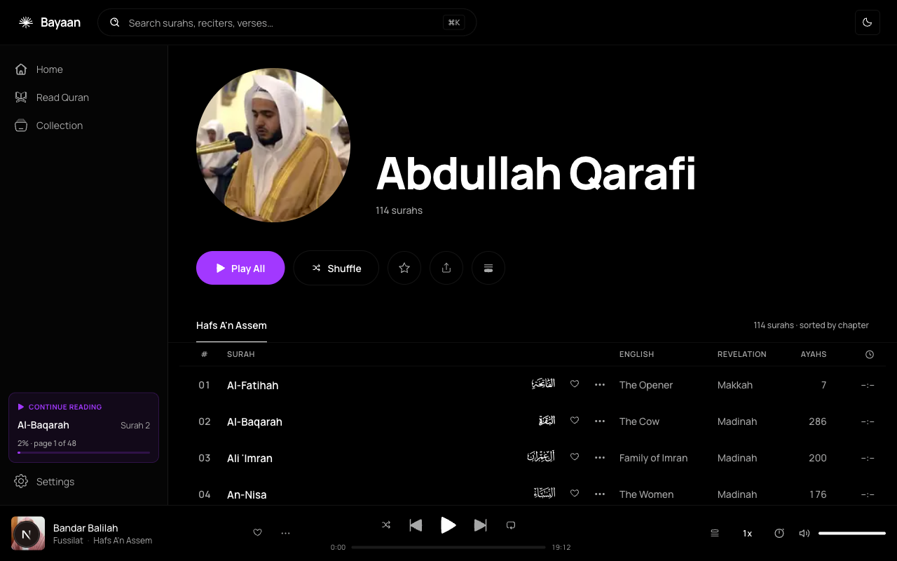

# Bayaan Web

**Open-source web client for Bayaan — listen to, read, and study the Holy Qur'an in the browser.**

Bayaan Web is the Next.js companion to the [Bayaan mobile app (Expo / React Native)](https://github.com/thebayaan/bayaan-mobile). It offers the same reciter catalogue, full Uthmani Mushaf, adhkar, playlists, bookmarks, and library features in a responsive web experience.

[](https://github.com/thebayaan/bayaan-web/actions/workflows/ci.yml)
[](LICENSE)
[](https://nextjs.org)
[](https://react.dev)
[](https://www.typescriptlang.org)



**Community:** [Code of Conduct](CODE_OF_CONDUCT.md) · [Security policy](SECURITY.md) · [Governance](GOVERNANCE.md) · [Contributing](CONTRIBUTING.md) · [Architecture & feature docs](docs/README.md)

> **Status:** Bayaan Web is under active development. The library (favorites, bookmarks, playlists, notes) is browser-local — there is no cloud sync yet. Translation and tafsir coverage tracks what the Quran.com public API provides. **Privacy:** Bayaan Web ships with zero telemetry — no PostHog, no Sentry, no Google Analytics.

---

## Features

- **Quran Reader** — Full Uthmani text, verse-by-verse and continuous layouts, multiple reading themes
- **Digital Mushaf** — Page-by-page classic Mushaf rendering at `/mushaf/[page]`
- **Adhkar** — Browse and read daily adhkar collections at `/adhkar`
- **Reciter catalogue** — 200+ reciters with full profiles at `/reciter/[slug]`
- **Library** — Bookmarks, favorites, notes, and custom playlists (stored locally in your browser)
- **Command palette** — ⌘K-style quick nav across the entire catalogue
- **Fuzzy search** — Fast client-side search via Fuse.js across reciters, surahs, adhkar
- **Share-ready** — OG images + Spotify-style metadata on every Quran, surah, verse, reciter, and adhkar page
- **Responsive** — Desktop + mobile UIs, light/dark/pure-black themes, `prefers-reduced-motion` aware

---

## Tech Stack

| Layer                    | Technology                                     |
| ------------------------ | ---------------------------------------------- |
| Framework                | Next.js 16 (App Router, Turbopack)             |
| Runtime                  | React 19                                       |
| Language                 | TypeScript 5 (strict)                          |
| Styling                  | Tailwind CSS 4 + `prettier-plugin-tailwindcss` |
| Components               | shadcn + `@base-ui/react`                      |
| State                    | Zustand (persisted to localStorage)            |
| Data fetching            | SWR                                            |
| Search                   | Fuse.js                                        |
| DnD                      | `@dnd-kit/*` (playlist reordering)             |
| Icons                    | `lucide-react`                                 |
| HTML sanitisation        | `dompurify`                                    |
| Unit + integration tests | Vitest + `@testing-library/react`              |
| E2E tests                | Playwright                                     |
| Linting                  | ESLint 9 (flat config) + Prettier              |
| Pre-commit               | Husky + lint-staged                            |

---

## Getting Started

### Prerequisites

- **Node.js 22+** (matches CI)
- **No API keys required to boot** — clone, install, and run. Quran reading, mushaf, adhkar, and library features work out of the box.
- **Optional:** a Bayaan backend API key for the live reciter catalogue and audio playback. Without it, reciter profiles and playback are unavailable; everything else still works from bundled data and public Quran APIs. See [CONTRIBUTING.md](CONTRIBUTING.md#backend-api-for-development) for how to request a community development key.

### Install

```bash
git clone https://github.com/thebayaan/bayaan-web.git
cd bayaan-web
npm install
```

### Configure environment (optional)

```bash
cp .env.example .env.local
```

All variables are documented inline in `.env.example`. None are required for local development.

| With no env vars                              | With `BAYAAN_API_KEY`                              |
| --------------------------------------------- | -------------------------------------------------- |
| Quran reader, mushaf, tafsir, transliteration | Everything above, plus reciter catalogue and audio |
| Adhkar, search, library (localStorage)        | Timestamps, OG images for reciter pages            |
| Bundled tajweed + transliteration data        | Live catalogue updates from the backend            |

Server routes proxy to `api.thebayaan.com` by default when API variables are unset.

### Run

```bash
npm run dev
# → http://localhost:3000
```

---

## Development commands

```bash
npm run dev           # Next.js dev server (Turbopack)
npm run build         # Production build
npm run start         # Run the production build

npm run lint          # ESLint
npm run typecheck     # tsc --noEmit
npm run format        # Prettier write
npm run format:check  # Prettier check (CI uses this)

npm test              # Vitest
npm run test:watch
npm run test:coverage
npm run test:e2e      # Playwright smoke tests
npm run test:e2e:ui   # Playwright UI mode
```

Pre-commit hooks (via Husky + lint-staged) run Prettier on staged files automatically.

---

## Project Structure

```
bayaan-web/
├── src/
│   ├── app/                # Next.js App Router
│   │   ├── (app)/          # Main app layout (shared shell)
│   │   │   ├── adhkar/     # Adhkar browser
│   │   │   ├── collection/ # Library: bookmarks, favorites, notes, playlists
│   │   │   ├── mushaf/     # Mushaf page reader
│   │   │   ├── quran/      # Verse-by-verse reader
│   │   │   ├── reciter/    # Reciter profile + track listing
│   │   │   ├── search/     # Fuzzy search across everything
│   │   │   ├── settings/   # User preferences
│   │   │   └── surah/      # Surah index
│   │   └── api/            # Server routes (Bayaan API proxy, Quran.com proxy, OG images)
│   ├── components/         # Shared UI components
│   ├── hooks/              # Custom React hooks (SWR helpers, playback, etc.)
│   ├── lib/                # Pure utilities (audio, fonts, metadata)
│   ├── services/           # API clients
│   ├── stores/             # Zustand stores
│   └── types/              # Shared TypeScript types
├── e2e/                    # Playwright specs
├── public/                 # Static assets (icons, bundled Quran data)
└── middleware.ts           # Next.js middleware (request passthrough)
```

---

## Contributing

Contributions are welcome. Please read [CONTRIBUTING.md](CONTRIBUTING.md) before opening a pull request.

Key points:

- Branch off `main`; bayaan-web uses trunk-based development (no `develop` branch).
- Run `npm run lint && npm run typecheck && npm run format:check && npm test` before opening a PR.
- CI runs all of the above plus a production build smoke test and a Playwright E2E pass on every PR.

---

## License

Bayaan Web is open source under the **GNU Affero General Public License v3.0 or later (AGPL-3.0-or-later)**.

In plain English:

- You are free to use, study, modify, and redistribute this code.
- If you run a modified version as a network service, you must make your modified source code available to users of that service.
- Any fork or derivative must be licensed under AGPL-3.0-or-later as well.
- "Bayaan" and the Bayaan logo are trademarks and are **not** licensed under AGPL. Forks must rebrand before distribution. See [TRADEMARKS.md](TRADEMARKS.md) for details.

See [LICENSE](LICENSE) for the full terms.

---

Built with care for the Muslim community.
